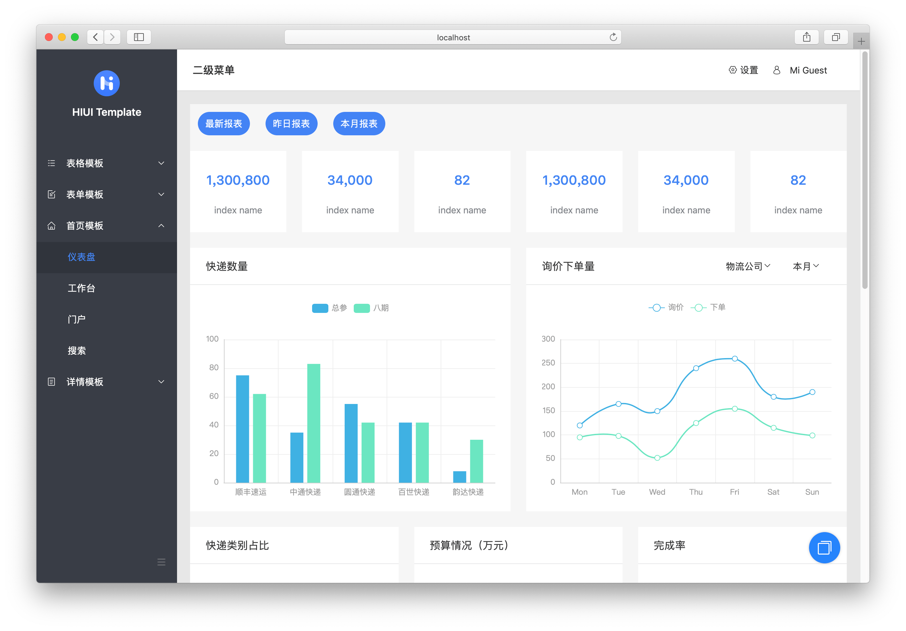
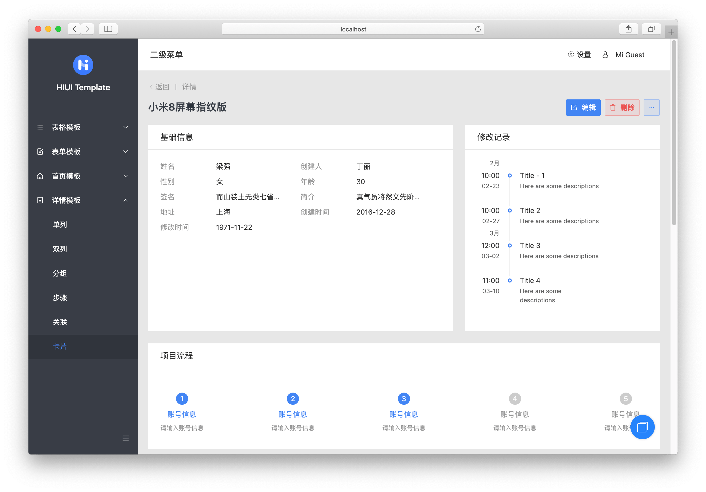
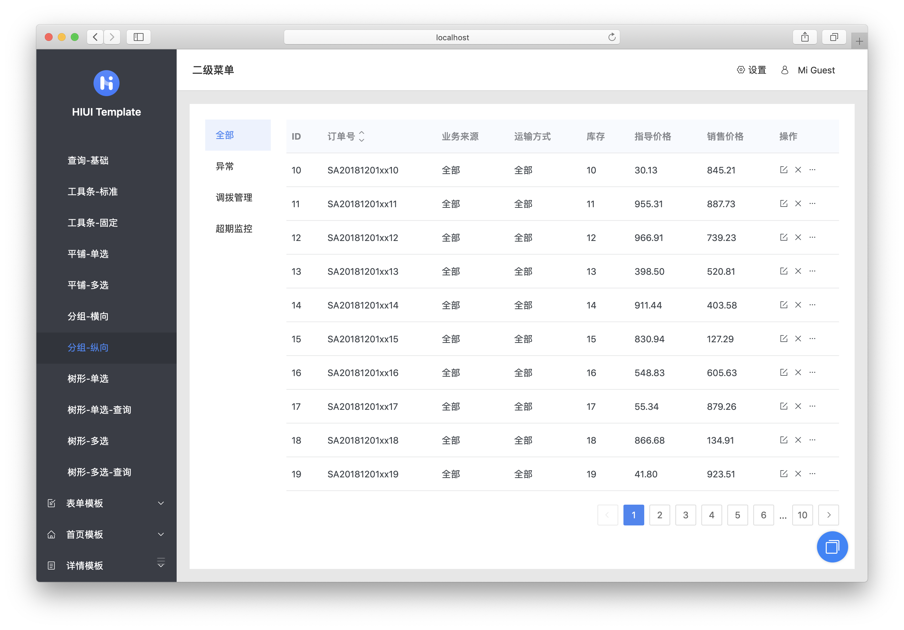

<div align="center">

[](https://xiaomi.github.io/hiui/)

<h1 align="center">HIUI Template</h1>

[](https://github.com/standard/standard)

</div>

HIUI Template for middle and backend systems.

## Features

- Highly minimize user perception of interaction costs and predictability of interactions
- Build outstanding vitual style and get vitual design and interface specification for typical scenario
- Highly refined design experience in OA, warehousing and after-sales systems, BI systems, and corporate mid-station projects

## Installation

```bash
git clone https://github.com/hiui-group/hiui-template.git
cd hiui-template
npm install
npm start
```

## Requirements

- 强制使用 typescript
- 如果使用图片等资源，需要托管到 CDN
- 页面内尽量不写 scss 样式，保持使用 HiUI 组件风格不变，或书写内联样式
- 通用业务组件可以使用自定义组件，可以内置 scss 样式
- className 必须以 `hi-pro-` 前缀打头，拒绝编写全局污染的样式
- 以页面作为模块进行提交 PR

## Screenshots





## License

[MIT](./LICENSE)
