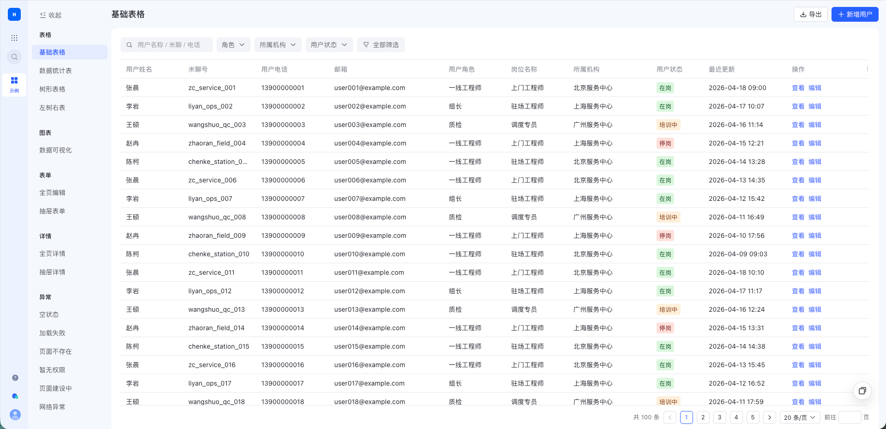
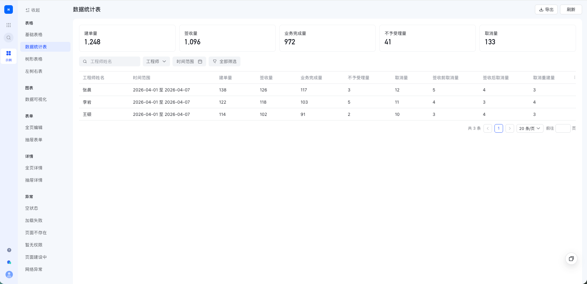
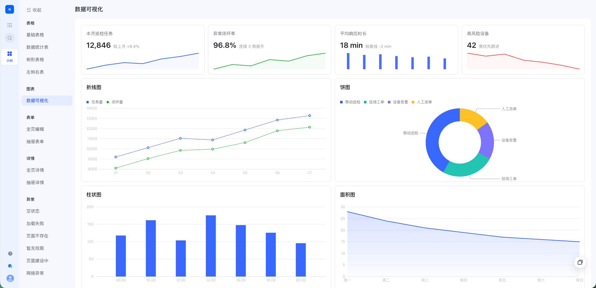

<div align="center">

<h1 align="center">HIUI Template</h1>

</div>

HIUI Template for middle and backend systems.

## Features

- Highly minimize user perception of interaction costs and predictability of interactions
- Build outstanding vitual style and get vitual design and interface specification for typical scenario
- Highly refined design experience in OA, warehousing and after-sales systems, BI systems, and corporate mid-station projects

## Installation

```bash
git clone https://github.com/hiui-group/hiui-template.git
cd hiui-template
npm install
npm run dev
```

## Screenshots





## License

[MIT](./LICENSE)
